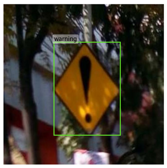
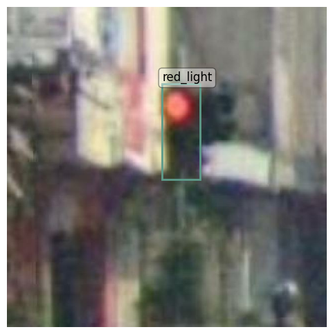

#  AkidaNet18/CenterNet (Custom Model)

## Dataset

| Structure | Informations |
|-----------|--------------|
| <pre>road_signs/<br>├── README.dataset.txt<br>├── README.roboflow.txt<br>├── road_signs.v2-release.tfrecord.zip<br>├── test<br>│   ├── game_label_map.pbtxt<br>│   └── game.tfrecord<br>├── train<br>│   ├── game_label_map.pbtxt<br>│   └── game.tfrecord<br>└── valid<br>    ├── game_label_map.pbtxt<br>    └── game.tfrecord</pre> | - **labels** = `['bus_stop', 'do_not_enter', 'do_not_stop', 'do_not_turn_l', 'do_not_turn_r', 'do_not_u_turn', 'enter_left_lane', 'green_light', 'left_right_lane', 'no_parking', 'parking', 'ped_crossing', 'ped_zebra_cross', 'railway_crossing', 'red_light', 'stop', 't_intersection_l', 'traffic_light', 'u_turn', 'warning', 'yellow_light']`<br>- **number of classes** = 21<br>- **training samples** = 1376<br>- **validation samples** = 488<br>- **test samples** = 229<br>- **size** = 160 MB (including zip file)<br>- **label formats** = tfrecord and **yolov8 (default)**|
|  |  |

## Source
This model uses the pre-trained base model centernet_akidanet18_voc_224.h5 from our data center: [**centernet_akidanet18_voc_224**](https://data.brainchip.com/models/AkidaV2/centernet/centernet_akidanet18_voc_384.h5)

## Create a transfer learning detection model from a base detection model
The script loads a pre-trained AkidaNet18 CenterNet model on the VOC dataset, then retrieves the output of the **head\_conv\_1/relu** layer. From this output, it adds a new **Conv2D (1x1)** layer whose number of filters corresponds to the number of classes in the new task plus four additional filters dedicated to bounding box regression. This new layer replaces the old "head" layer that was trained for 20 VOC classes. A new model is then built keeping the same inputs as the original but redirecting the output to this new layer. Finally, the script displays a summary of the adapted model and saves it in an **adapted\_model.h5** file.

```python
import os
from quantizeml.model_io import load_model
from tf_keras.models import Model
from tf_keras.layers import Conv2D

# set the number of classes in this dataset
NUM_CLASSES = 21

# Download the centernet base model
URL='https://data.brainchip.com/models/AkidaV2/centernet/centernet_akidanet18_voc_224.h5'
!wget -N {URL} -P ./pretrained_models/

# Loading a pre-trained CenterNet AkidaNet18 detection model onto VOC.
base_model_path = os.path.join('./pretrained_models', 'centernet_akidanet18_voc_224.h5')
base_model = load_model(base_model_path) 
# Extracting the output of an existing layer: head_conv_1/relu.
ll = base_model.get_layer('head_conv_1/relu') 
# Adding a new Conv2D (1x1) layer as output.
# The number of filters in this layer = NUM_CLASSES + 4 (for bounding box coordinates).
# This layer replaces the old "head" layer trained for 20 VOC classes.
out = ll.output 
x = Conv2D(NUM_CLASSES + 4, 
           (1, 1), 
           padding="same", 
           use_bias=True, 
           name="head_conv_2")(out) 
# Building a new model with the same input as the original.
# Setting the model output to the new layer.
adapted_model = Model(inputs=base_model.input, outputs=x) 
# Displaying the adapted model summary.
adapted_model.summary() 
# The new model is saved in an .h5 file.
save_model_path = os.path.join('./pretrained_models', 'centernet_akidanet18_road_signs_adapted_224.h5')
adapted_model.save(save_model_path)
```

### Environment
```
tf_keras: 2.19
cnn2snn: 2.17.0
quantizeml: 1.0.1
```


## Training Details
- **Backbone**: AkidaNet18 backbone and centernet head


## References
- **AkidaNet18**: Akida model API [AkidaNet18 architecture](https://doc.brainchipinc.com/api_reference/akida_models_apis.html#akida_models.akidanet18_imagenet)
- **Dataset**: [road signs detection](https://universe.roboflow.com/roboflow-100/road-signs-6ih4y/dataset/2)


## License
Apache 2.0 License (models only)
